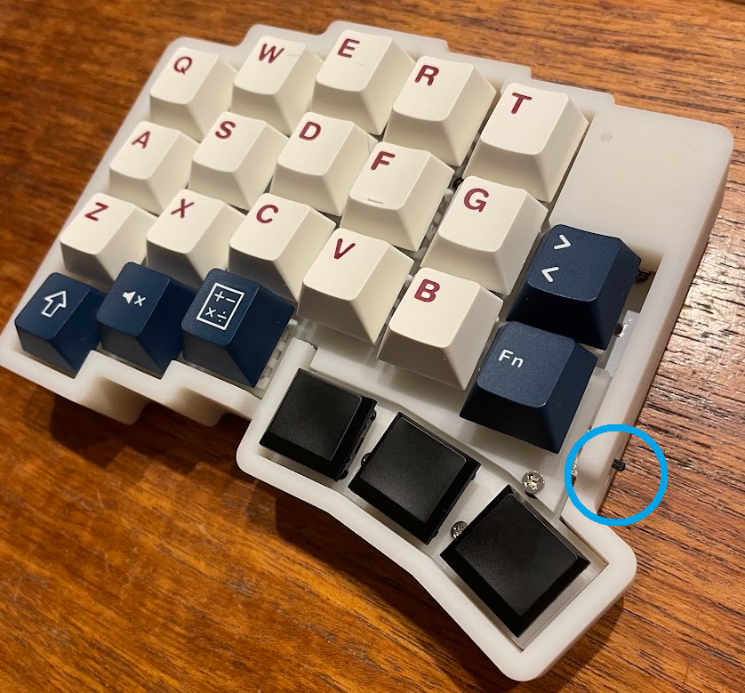
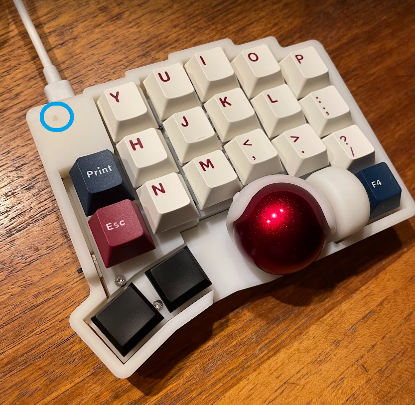

## roBa bluetooth対応改造版keyball39
- フォームウェアにZMKを使用
- 5個のbluetooth接続プロファイルを保持
- 有線接続にも対応。
- LiPoバッテリーを搭載し、繰り返し充電可能 

## 電源スイッチ
- 電源スイッチは下記写真の〇印の箇所にあります。上がON,下がOFFです。

## 特記事項
- 充電する際は、スイッチONの状態で行ってください。
- PCでbluetoothデバイスとして「roBa」という名前で認識されます。
- bluetooth接続プロファイルはキーボード上で選択、削除ができます。
- 初期キーマップではレイヤー6にbluetoothプロファイルのキー配置をしています。BT_SEL0～4の切り替えで接続先デバイスの切替が可能で、BT_CLTにてプロファイル削除が可能です。
- PCの設定はUS配列を推奨します。日本語配列にて使用すると、記号など設定したキーと異なる出力がされてしまうことがあります。
- オートマウスレイヤーが4、スクロールレイヤーが5となっています。

## キーマップの変更方法①　簡易版
- 2025/1/31以降、ファームウェア更新によりzmk studio対応可能となります。
-  [zmk studio](https://zmk.studio/)にアクセスすることでブラウザ上でキーマップ変更が完結します。
- しかし、ロータリエンコーダのキー割り当てやコンボやマクロの割り当てができない状況です。
- 以下の「キーマップの変更方法②　詳細版」にてキーマップ変更を実施していただければ、ファームウェアも合わせて更新されるので、以降はzmk studioが使用可能となります。

## キーマップの変更方法②　詳細版
- githubにログインしてください。アカウントをお持ちでなければ作成してください。
- このリポジトリをフォークして、自身のリポジトリとしてください。
- 初回のみ、Actionsを開いて次のボタンをクリックしてください。
- [キーマップエディタ](https://nickcoutsos.github.io/keymap-editor/)でgithubと連携後、キーマップを変更し、saveボタンを押してください。
- 5分程度経過するとフォームウェアの生成が完了しますので、このボタンをクリックしてください。
- 画面下部へスクロールして `firmware.zip`をダウンロード及び解凍してください。
- 右側（トラックボール側）キーボードをPCとUSBケーブルで接続し、写真の〇印にリセットボタンがあるので、ダブルクリックしてください。
- 
- ダブルクリックに成功すると、`XIAO-SENSE`という名前でドライブが認識されるので、ダウンロードしたのフォームウェアを移動させます。移動させるファイルは`roBa_R-seeeduino_xiao_ble-zmk.uf2`です。
- 数秒間でファイルの書き込みは終了し、書き込みに成功するとＰＣとの接続が勝手に解除され、フォルダは閉じられます。
- macにて書き込み操作をすると、エラーコード　‐36　等が上がりますが、無事書き込めています。
- 書き込みが完了したら、キーマップが変更されていることを確認してください。
- 左手側の書き換えは不要です。
- もしBluetoothの接続に不調があれば、生成されたfirmware.zip内に格納されている`settings_reset-seeeduino_xiao_ble-zmk.uf2`を左右両方に書き込んでください。初期化されますので、再度フォームウエアの書き込みをを願いします。その場合は、左手→`roBa_L-seeeduino_xiao_ble-zmk.uf2`、右手→`roBa_R-seeeduino_xiao_ble-zmk.uf2`の書き込みを実施してください。

## その他
- [ビルドガイド](https://github.com/kumamuk-git/roBa/blob/main/doc/v2/buildguide_v2.md))にもキーマップ変更方法が記載されております。
